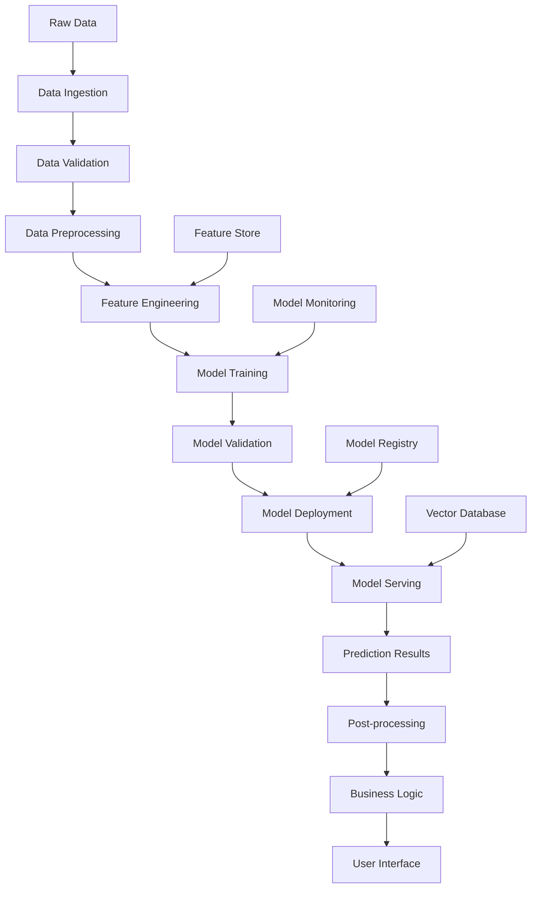

# HLOLA GRC Platform - AI Integration Design Document

## Table of Contents
1. [Executive Summary](#executive-summary)
2. [AI Integration Strategy](#ai-integration-strategy)
3. [AI Use Cases & Implementation Areas](#ai-use-cases--implementation-areas)
4. [Technical Architecture](#technical-architecture)
5. [AI Models & Technologies](#ai-models--technologies)
6. [Data Pipeline for AI](#data-pipeline-for-ai)
7. [AI-Powered Features](#ai-powered-features)
8. [Implementation Roadmap](#implementation-roadmap)
9. [Ethics & Compliance](#ethics--compliance)
10. [Performance & Scalability](#performance--scalability)

---

## Executive Summary

### Overview
The HLOLA GRC Platform will integrate Artificial Intelligence (AI) capabilities to automate compliance processes, enhance risk assessment, provide intelligent insights, and improve user experience. This document outlines a comprehensive AI integration strategy that leverages machine learning, natural language processing, and predictive analytics to transform the GRC landscape in Africa.

### Key AI Objectives
- **Automated Compliance Monitoring**: Real-time compliance status tracking and alerts
- **Intelligent Risk Assessment**: AI-powered risk identification and scoring
- **Smart Document Analysis**: Automated document review and compliance checking
- **Predictive Analytics**: Forecast compliance trends and potential issues
- **Natural Language Processing**: Automated policy analysis and requirement extraction
- **Personalized Recommendations**: AI-driven compliance guidance and best practices

### Business Impact
- **Efficiency Gains**: 60-80% reduction in manual compliance tasks
- **Risk Reduction**: 40-50% improvement in risk identification accuracy
- **Cost Savings**: 30-40% reduction in compliance management costs
- **User Experience**: 70% improvement in user satisfaction and adoption
- **Compliance Accuracy**: 90%+ accuracy in automated compliance assessments

---

## AI Integration Strategy

### 1. AI-First Design Principles

#### **Human-AI Collaboration**
```typescript
interface HumanAICollaboration {
  // AI handles routine tasks
  automation: {
    documentProcessing: boolean;
    complianceChecking: boolean;
    riskScoring: boolean;
    reportGeneration: boolean;
  };
  
  // Humans make critical decisions
  humanOversight: {
    riskApproval: boolean;
    policyDecisions: boolean;
    complianceExceptions: boolean;
    strategicPlanning: boolean;
  };
  
  // Collaborative features
  collaboration: {
    aiRecommendations: boolean;
    humanFeedback: boolean;
    learningLoop: boolean;
    explainableAI: boolean;
  };
}
```

#### **Explainable AI (XAI)**
- **Transparency**: Clear explanations for AI decisions
- **Auditability**: Traceable AI reasoning processes
- **Trust Building**: User confidence in AI recommendations
- **Regulatory Compliance**: Meeting AI transparency requirements

### 2. AI Integration Architecture

#### **Multi-Layer AI Architecture**
```
┌─────────────────────────────────────────────────────────────┐
│                    AI Application Layer                     │
├─────────────────────────────────────────────────────────────┤
│  Compliance AI  │  Risk AI  │  Document AI  │  Insight AI  │
├─────────────────────────────────────────────────────────────┤
│                    AI Service Layer                         │
├─────────────────────────────────────────────────────────────┤
│  ML Pipeline  │  NLP Service  │  Prediction  │  Learning   │
├─────────────────────────────────────────────────────────────┤
│                    AI Infrastructure Layer                  │
├─────────────────────────────────────────────────────────────┤
│  Model Store  │  Training  │  Inference  │  Monitoring   │
├─────────────────────────────────────────────────────────────┤
│                    Data Layer                               │
├─────────────────────────────────────────────────────────────┤
│  Training Data  │  Feature Store  │  Vector DB  │  Cache   │
└─────────────────────────────────────────────────────────────┘
```

### 3. AI Technology Stack

#### **Core AI Technologies**
```typescript
interface AITechnologyStack {
  // Machine Learning
  ml: {
    framework: 'TensorFlow' | 'PyTorch' | 'Scikit-learn';
    platform: 'MLflow' | 'Kubeflow' | 'Azure ML';
    deployment: 'Docker' | 'Kubernetes' | 'Serverless';
  };
  
  // Natural Language Processing
  nlp: {
    models: 'GPT-4' | 'Claude' | 'Llama' | 'BERT';
    services: 'OpenAI API' | 'Azure Cognitive Services' | 'AWS Comprehend';
    embeddings: 'OpenAI Embeddings' | 'Sentence-BERT' | 'Custom Models';
  };
  
  // Computer Vision
  cv: {
    ocr: 'Tesseract' | 'AWS Textract' | 'Azure Form Recognizer';
    documentAnalysis: 'Custom CNN' | 'Vision Transformers';
    imageProcessing: 'OpenCV' | 'PIL' | 'Custom Models';
  };
  
  // Vector Database
  vectorDB: {
    primary: 'Pinecone' | 'Weaviate' | 'Chroma' | 'Qdrant';
    backup: 'Elasticsearch' | 'PostgreSQL with pgvector';
  };
  
  // MLOps
  mlops: {
    experimentTracking: 'MLflow' | 'Weights & Biases' | 'Neptune';
    modelRegistry: 'MLflow Model Registry' | 'Azure ML Registry';
    monitoring: 'Evidently AI' | 'Arize' | 'Custom Monitoring';
  };
}
```

---

## AI Use Cases & Implementation Areas

### 1. Compliance Management AI

#### **Automated Compliance Monitoring**
```typescript
interface ComplianceAI {
  // Real-time compliance checking
  realTimeMonitoring: {
    policyViolations: PolicyViolationDetection;
    controlFailures: ControlFailureDetection;
    complianceDrift: ComplianceDriftDetection;
    regulatoryChanges: RegulatoryChangeDetection;
  };
  
  // Compliance scoring
  scoring: {
    frameworkCompliance: FrameworkComplianceScore;
    controlEffectiveness: ControlEffectivenessScore;
    riskCompliance: RiskComplianceScore;
    overallCompliance: OverallComplianceScore;
  };
  
  // Automated reporting
  reporting: {
    complianceReports: AutomatedComplianceReport;
    exceptionReports: ExceptionReport;
    trendAnalysis: ComplianceTrendAnalysis;
    recommendations: ComplianceRecommendations;
  };
}

interface PolicyViolationDetection {
  // AI model for detecting policy violations
  model: {
    type: 'classification' | 'anomaly_detection';
    algorithm: 'Random Forest' | 'XGBoost' | 'Isolation Forest';
    accuracy: number;
    precision: number;
    recall: number;
  };
  
  // Real-time monitoring
  monitoring: {
    dataSources: string[];
    checkFrequency: string;
    alertThreshold: number;
    notificationChannels: string[];
  };
  
  // Violation types
  violationTypes: {
    dataAccess: ViolationType;
    dataProcessing: ViolationType;
    dataRetention: ViolationType;
    consentManagement: ViolationType;
    dataTransfer: ViolationType;
  };
}
```

#### **Implementation Areas**
- **Policy Violation Detection**: Monitor user actions against compliance policies
- **Control Testing Automation**: Automated testing of compliance controls
- **Regulatory Change Monitoring**: Track regulatory updates and impact assessment
- **Compliance Gap Analysis**: Identify gaps in current compliance posture

### 2. Risk Assessment AI

#### **Intelligent Risk Analysis**
```typescript
interface RiskAssessmentAI {
  // Risk identification
  identification: {
    automatedRiskDiscovery: AutomatedRiskDiscovery;
    riskPatternRecognition: RiskPatternRecognition;
    emergingRiskDetection: EmergingRiskDetection;
    riskCorrelationAnalysis: RiskCorrelationAnalysis;
  };
  
  // Risk scoring
  scoring: {
    likelihoodPrediction: LikelihoodPrediction;
    impactAssessment: ImpactAssessment;
    riskScoreCalculation: RiskScoreCalculation;
    riskPrioritization: RiskPrioritization;
  };
  
  // Risk mitigation
  mitigation: {
    mitigationRecommendations: MitigationRecommendations;
    controlEffectiveness: ControlEffectivenessAnalysis;
    riskTreatmentOptions: RiskTreatmentOptions;
    costBenefitAnalysis: CostBenefitAnalysis;
  };
}

interface AutomatedRiskDiscovery {
  // Data sources for risk discovery
  dataSources: {
    internal: string[];
    external: string[];
    historical: string[];
    realTime: string[];
  };
  
  // AI models for risk discovery
  models: {
    nlpModel: 'BERT' | 'RoBERTa' | 'Custom Risk NLP';
    mlModel: 'Random Forest' | 'Gradient Boosting' | 'Neural Network';
    ensembleModel: 'Voting Classifier' | 'Stacking' | 'Blending';
  };
  
  // Risk categories
  riskCategories: {
    dataPrivacy: RiskCategory;
    cybersecurity: RiskCategory;
    operational: RiskCategory;
    regulatory: RiskCategory;
    financial: RiskCategory;
    reputational: RiskCategory;
  };
}
```

#### **Implementation Areas**
- **Automated Risk Discovery**: AI-powered identification of new risks
- **Risk Scoring**: Machine learning-based risk quantification
- **Risk Correlation**: Identify relationships between different risks
- **Mitigation Recommendations**: AI-suggested risk treatment options

### 3. Document Intelligence AI

#### **Smart Document Processing**
```typescript
interface DocumentIntelligenceAI {
  // Document analysis
  analysis: {
    documentClassification: DocumentClassification;
    contentExtraction: ContentExtraction;
    complianceChecking: DocumentComplianceChecking;
    versionComparison: VersionComparison;
  };
  
  // Natural language processing
  nlp: {
    entityExtraction: EntityExtraction;
    sentimentAnalysis: SentimentAnalysis;
    topicModeling: TopicModeling;
    summarization: DocumentSummarization;
  };
  
  // Document generation
  generation: {
    policyGeneration: PolicyGeneration;
    reportGeneration: ReportGeneration;
    templateCreation: TemplateCreation;
    contentOptimization: ContentOptimization;
  };
}

interface DocumentClassification {
  // Document types
  documentTypes: {
    policies: DocumentType;
    procedures: DocumentType;
    contracts: DocumentType;
    reports: DocumentType;
    forms: DocumentType;
    notices: DocumentType;
  };
  
  // Classification models
  models: {
    primary: 'BERT' | 'RoBERTa' | 'Custom Document Classifier';
    fallback: 'Rule-based' | 'Keyword Matching';
    ensemble: 'Voting' | 'Stacking';
  };
  
  // Classification features
  features: {
    textContent: boolean;
    documentStructure: boolean;
    metadata: boolean;
    formatting: boolean;
    images: boolean;
  };
}
```

#### **Implementation Areas**
- **Document Classification**: Automatically categorize documents
- **Content Extraction**: Extract key information from documents
- **Compliance Checking**: Verify document compliance with regulations
- **Policy Generation**: AI-assisted policy and procedure creation

### 4. Predictive Analytics AI

#### **Intelligent Forecasting**
```typescript
interface PredictiveAnalyticsAI {
  // Compliance forecasting
  complianceForecasting: {
    complianceTrends: ComplianceTrendForecasting;
    riskPrediction: RiskPrediction;
    auditOutcomes: AuditOutcomePrediction;
    regulatoryChanges: RegulatoryChangePrediction;
  };
  
  // Business intelligence
  businessIntelligence: {
    userBehaviorAnalysis: UserBehaviorAnalysis;
    featureUsagePrediction: FeatureUsagePrediction;
    churnPrediction: ChurnPrediction;
    growthForecasting: GrowthForecasting;
  };
  
  // Resource optimization
  resourceOptimization: {
    workloadPrediction: WorkloadPrediction;
    resourceAllocation: ResourceAllocation;
    capacityPlanning: CapacityPlanning;
    costOptimization: CostOptimization;
  };
}

interface ComplianceTrendForecasting {
  // Time series models
  models: {
    arima: ARIMAModel;
    lstm: LSTMModel;
    prophet: ProphetModel;
    ensemble: EnsembleModel;
  };
  
  // Forecasting horizons
  horizons: {
    shortTerm: '1-3 months';
    mediumTerm: '3-12 months';
    longTerm: '1-3 years';
  };
  
  // Metrics to forecast
  metrics: {
    complianceScore: MetricForecast;
    riskLevel: MetricForecast;
    controlEffectiveness: MetricForecast;
    auditFindings: MetricForecast;
  };
}
```

#### **Implementation Areas**
- **Compliance Trends**: Predict future compliance performance
- **Risk Forecasting**: Anticipate emerging risks
- **Resource Planning**: Optimize resource allocation
- **User Behavior**: Predict user needs and preferences

### 5. Natural Language Processing AI

#### **Intelligent Text Processing**
```typescript
interface NLPProcessingAI {
  // Text analysis
  textAnalysis: {
    entityRecognition: NamedEntityRecognition;
    sentimentAnalysis: SentimentAnalysis;
    topicExtraction: TopicExtraction;
    languageDetection: LanguageDetection;
  };
  
  // Question answering
  questionAnswering: {
    complianceQA: ComplianceQuestionAnswering;
    policyQA: PolicyQuestionAnswering;
    riskQA: RiskQuestionAnswering;
    generalQA: GeneralQuestionAnswering;
  };
  
  // Text generation
  textGeneration: {
    reportGeneration: ReportGeneration;
    emailGeneration: EmailGeneration;
    documentationGeneration: DocumentationGeneration;
    summaryGeneration: SummaryGeneration;
  };
}

interface ComplianceQuestionAnswering {
  // Knowledge base
  knowledgeBase: {
    policies: PolicyKnowledgeBase;
    regulations: RegulationKnowledgeBase;
    procedures: ProcedureKnowledgeBase;
    faqs: FAQKnowledgeBase;
  };
  
  // QA models
  models: {
    retrieval: 'Dense Passage Retrieval' | 'BM25' | 'Custom Retrieval';
    generation: 'GPT-4' | 'Claude' | 'Custom QA Model';
    reranking: 'Cross-Encoder' | 'Custom Reranker';
  };
  
  // Answer quality
  quality: {
    accuracy: number;
    relevance: number;
    completeness: number;
    confidence: number;
  };
}
```

#### **Implementation Areas**
- **Compliance Q&A**: Answer compliance-related questions
- **Policy Analysis**: Analyze and interpret policies
- **Report Generation**: Generate compliance reports
- **Multi-language Support**: Support for African languages

---

## Technical Architecture

### 1. AI Service Architecture

#### **Microservices AI Architecture**
```typescript
interface AIServiceArchitecture {
  // AI Services
  services: {
    complianceAI: ComplianceAIService;
    riskAI: RiskAIService;
    documentAI: DocumentAIService;
    nlpAI: NLPAIService;
    predictionAI: PredictionAIService;
  };
  
  // AI Infrastructure
  infrastructure: {
    modelRegistry: ModelRegistry;
    featureStore: FeatureStore;
    vectorDatabase: VectorDatabase;
    mlPipeline: MLPipeline;
    monitoring: AIMonitoring;
  };
  
  // Data Pipeline
  dataPipeline: {
    dataIngestion: DataIngestion;
    dataProcessing: DataProcessing;
    featureEngineering: FeatureEngineering;
    modelTraining: ModelTraining;
    modelServing: ModelServing;
  };
}
```

#### **AI Service Implementation**
```typescript
// Compliance AI Service
class ComplianceAIService {
  private modelRegistry: ModelRegistry;
  private featureStore: FeatureStore;
  private vectorDB: VectorDatabase;
  
  async checkCompliance(data: ComplianceData): Promise<ComplianceResult> {
    // Load compliance model
    const model = await this.modelRegistry.getModel('compliance_classifier');
    
    // Extract features
    const features = await this.featureStore.extractFeatures(data);
    
    // Run inference
    const prediction = await model.predict(features);
    
    // Post-process results
    return this.postProcessPrediction(prediction);
  }
  
  async generateComplianceReport(organizationId: string): Promise<ComplianceReport> {
    // Gather compliance data
    const complianceData = await this.gatherComplianceData(organizationId);
    
    // Generate report using AI
    const report = await this.generateReport(complianceData);
    
    return report;
  }
}
```

### 2. AI Data Pipeline

#### **End-to-End AI Pipeline**


#### **Data Pipeline Implementation**
```typescript
interface AIDataPipeline {
  // Data ingestion
  ingestion: {
    batchProcessing: BatchDataIngestion;
    streamProcessing: StreamDataIngestion;
    realTimeProcessing: RealTimeDataIngestion;
  };
  
  // Data processing
  processing: {
    cleaning: DataCleaning;
    transformation: DataTransformation;
    normalization: DataNormalization;
    augmentation: DataAugmentation;
  };
  
  // Feature engineering
  featureEngineering: {
    featureExtraction: FeatureExtraction;
    featureSelection: FeatureSelection;
    featureScaling: FeatureScaling;
    featureStorage: FeatureStorage;
  };
  
  // Model lifecycle
  modelLifecycle: {
    training: ModelTraining;
    validation: ModelValidation;
    deployment: ModelDeployment;
    monitoring: ModelMonitoring;
    retraining: ModelRetraining;
  };
}
```

### 3. AI Model Management

#### **Model Registry & Versioning**
```typescript
interface ModelManagement {
  // Model registry
  registry: {
    modelStorage: ModelStorage;
    versioning: ModelVersioning;
    metadata: ModelMetadata;
    lineage: ModelLineage;
  };
  
  // Model deployment
  deployment: {
    environments: Environment[];
    strategies: DeploymentStrategy[];
    rollback: RollbackStrategy;
    monitoring: DeploymentMonitoring;
  };
  
  // Model monitoring
  monitoring: {
    performance: PerformanceMonitoring;
    drift: DataDriftMonitoring;
    bias: BiasMonitoring;
    explainability: ExplainabilityMonitoring;
  };
}

interface ModelMetadata {
  name: string;
  version: string;
  algorithm: string;
  accuracy: number;
  precision: number;
  recall: number;
  f1Score: number;
  trainingData: string;
  features: string[];
  hyperparameters: Record<string, any>;
  createdAt: string;
  updatedAt: string;
  status: 'training' | 'validated' | 'deployed' | 'deprecated';
}
```

---

## AI Models & Technologies

### 1. Machine Learning Models

#### **Compliance Classification Models**
```python
# Compliance Classification Model
class ComplianceClassifier:
    def __init__(self):
        self.model = None
        self.vectorizer = None
        self.label_encoder = None
    
    def train(self, X_train, y_train):
        # Feature extraction
        self.vectorizer = TfidfVectorizer(
            max_features=10000,
            ngram_range=(1, 3),
            stop_words='english'
        )
        X_train_vectorized = self.vectorizer.fit_transform(X_train)
        
        # Model training
        self.model = RandomForestClassifier(
            n_estimators=100,
            max_depth=20,
            random_state=42
        )
        self.model.fit(X_train_vectorized, y_train)
        
        # Label encoding
        self.label_encoder = LabelEncoder()
        self.label_encoder.fit(y_train)
    
    def predict(self, X):
        X_vectorized = self.vectorizer.transform(X)
        predictions = self.model.predict(X_vectorized)
        probabilities = self.model.predict_proba(X_vectorized)
        
        return {
            'predictions': self.label_encoder.inverse_transform(predictions),
            'probabilities': probabilities,
            'confidence': np.max(probabilities, axis=1)
        }
```

#### **Risk Assessment Models**
```python
# Risk Assessment Model
class RiskAssessmentModel:
    def __init__(self):
        self.models = {
            'likelihood': None,
            'impact': None,
            'overall': None
        }
    
    def train(self, risk_data):
        # Likelihood prediction
        self.models['likelihood'] = XGBRegressor(
            n_estimators=100,
            max_depth=6,
            learning_rate=0.1
        )
        self.models['likelihood'].fit(
            risk_data['features'],
            risk_data['likelihood']
        )
        
        # Impact prediction
        self.models['impact'] = XGBRegressor(
            n_estimators=100,
            max_depth=6,
            learning_rate=0.1
        )
        self.models['impact'].fit(
            risk_data['features'],
            risk_data['impact']
        )
        
        # Overall risk score
        self.models['overall'] = XGBRegressor(
            n_estimators=100,
            max_depth=6,
            learning_rate=0.1
        )
        self.models['overall'].fit(
            risk_data['features'],
            risk_data['overall_score']
        )
    
    def assess_risk(self, features):
        likelihood = self.models['likelihood'].predict([features])[0]
        impact = self.models['impact'].predict([features])[0]
        overall = self.models['overall'].predict([features])[0]
        
        return {
            'likelihood': likelihood,
            'impact': impact,
            'overall_score': overall,
            'risk_level': self._categorize_risk(overall)
        }
```

### 2. Natural Language Processing Models

#### **Document Analysis Pipeline**
```python
# Document Analysis Pipeline
class DocumentAnalysisPipeline:
    def __init__(self):
        self.nlp_model = None
        self.classifier = None
        self.extractor = None
    
    def initialize_models(self):
        # Load pre-trained NLP model
        self.nlp_model = pipeline(
            "document-question-answering",
            model="microsoft/layoutlm-base-uncased"
        )
        
        # Load document classifier
        self.classifier = pipeline(
            "text-classification",
            model="microsoft/DialoGPT-medium"
        )
        
        # Load entity extractor
        self.extractor = pipeline(
            "ner",
            model="dbmdz/bert-large-cased-finetuned-conll03-english"
        )
    
    def analyze_document(self, document):
        # Document classification
        classification = self.classifier(document['text'])
        
        # Entity extraction
        entities = self.extractor(document['text'])
        
        # Compliance checking
        compliance_result = self.check_compliance(document)
        
        # Summary generation
        summary = self.generate_summary(document['text'])
        
        return {
            'classification': classification,
            'entities': entities,
            'compliance': compliance_result,
            'summary': summary
        }
```

### 3. Deep Learning Models

#### **Neural Network for Compliance Prediction**
```python
# Neural Network for Compliance Prediction
class ComplianceNeuralNetwork:
    def __init__(self, input_dim, hidden_dims, output_dim):
        self.model = self._build_model(input_dim, hidden_dims, output_dim)
        self.scaler = StandardScaler()
    
    def _build_model(self, input_dim, hidden_dims, output_dim):
        model = Sequential()
        
        # Input layer
        model.add(Dense(hidden_dims[0], activation='relu', input_dim=input_dim))
        model.add(Dropout(0.2))
        
        # Hidden layers
        for dim in hidden_dims[1:]:
            model.add(Dense(dim, activation='relu'))
            model.add(Dropout(0.2))
        
        # Output layer
        model.add(Dense(output_dim, activation='softmax'))
        
        # Compile model
        model.compile(
            optimizer='adam',
            loss='categorical_crossentropy',
            metrics=['accuracy']
        )
        
        return model
    
    def train(self, X_train, y_train, X_val, y_val, epochs=100):
        # Scale features
        X_train_scaled = self.scaler.fit_transform(X_train)
        X_val_scaled = self.scaler.transform(X_val)
        
        # Train model
        history = self.model.fit(
            X_train_scaled, y_train,
            validation_data=(X_val_scaled, y_val),
            epochs=epochs,
            batch_size=32,
            verbose=1
        )
        
        return history
    
    def predict(self, X):
        X_scaled = self.scaler.transform(X)
        predictions = self.model.predict(X_scaled)
        return predictions
```

---

## Data Pipeline for AI

### 1. Data Collection & Preparation

#### **Data Sources for AI Training**
```typescript
interface AIDataSources {
  // Compliance data
  complianceData: {
    policies: PolicyDocument[];
    procedures: ProcedureDocument[];
    auditReports: AuditReport[];
    complianceAssessments: ComplianceAssessment[];
    controlTests: ControlTest[];
  };
  
  // Risk data
  riskData: {
    riskRegisters: RiskRegister[];
    riskAssessments: RiskAssessment[];
    incidentReports: IncidentReport[];
    riskMitigations: RiskMitigation[];
  };
  
  // User behavior data
  userBehaviorData: {
    userActions: UserAction[];
    featureUsage: FeatureUsage[];
    sessionData: SessionData[];
    feedbackData: FeedbackData[];
  };
  
  // External data
  externalData: {
    regulatoryUpdates: RegulatoryUpdate[];
    industryReports: IndustryReport[];
    threatIntelligence: ThreatIntelligence[];
    marketData: MarketData[];
  };
}
```

#### **Data Preprocessing Pipeline**
```python
# Data Preprocessing Pipeline
class AIDataPreprocessor:
    def __init__(self):
        self.text_processor = TextProcessor()
        self.numerical_processor = NumericalProcessor()
        self.categorical_processor = CategoricalProcessor()
    
    def preprocess_compliance_data(self, data):
        # Text preprocessing
        processed_text = self.text_processor.process(data['text'])
        
        # Numerical features
        numerical_features = self.numerical_processor.process(
            data['numerical_features']
        )
        
        # Categorical features
        categorical_features = self.categorical_processor.process(
            data['categorical_features']
        )
        
        return {
            'text': processed_text,
            'numerical': numerical_features,
            'categorical': categorical_features
        }
    
    def preprocess_risk_data(self, data):
        # Risk-specific preprocessing
        risk_features = self.extract_risk_features(data)
        
        # Normalize risk scores
        normalized_scores = self.normalize_risk_scores(
            data['risk_scores']
        )
        
        return {
            'features': risk_features,
            'scores': normalized_scores
        }
```

### 2. Feature Engineering

#### **Feature Engineering for GRC AI**
```python
# Feature Engineering for GRC AI
class GRCFeatureEngineer:
    def __init__(self):
        self.text_features = TextFeatureExtractor()
        self.temporal_features = TemporalFeatureExtractor()
        self.compliance_features = ComplianceFeatureExtractor()
    
    def extract_compliance_features(self, data):
        features = {}
        
        # Text features
        features['text_embeddings'] = self.text_features.extract_embeddings(
            data['text']
        )
        
        # Temporal features
        features['temporal'] = self.temporal_features.extract(
            data['timestamps']
        )
        
        # Compliance-specific features
        features['compliance'] = self.compliance_features.extract(
            data['compliance_data']
        )
        
        return features
    
    def extract_risk_features(self, data):
        features = {}
        
        # Historical risk data
        features['historical'] = self.extract_historical_features(
            data['historical_risks']
        )
        
        # Current risk indicators
        features['current'] = self.extract_current_features(
            data['current_indicators']
        )
        
        # External factors
        features['external'] = self.extract_external_features(
            data['external_factors']
        )
        
        return features
```

### 3. Model Training & Validation

#### **Model Training Pipeline**
```python
# Model Training Pipeline
class ModelTrainingPipeline:
    def __init__(self):
        self.data_loader = DataLoader()
        self.feature_engineer = GRCFeatureEngineer()
        self.model_trainer = ModelTrainer()
        self.validator = ModelValidator()
    
    def train_compliance_model(self, training_data):
        # Load and preprocess data
        processed_data = self.data_loader.load_compliance_data(training_data)
        
        # Extract features
        features = self.feature_engineer.extract_compliance_features(
            processed_data
        )
        
        # Split data
        X_train, X_val, y_train, y_val = train_test_split(
            features, processed_data['labels'], test_size=0.2
        )
        
        # Train model
        model = self.model_trainer.train_compliance_classifier(
            X_train, y_train
        )
        
        # Validate model
        validation_results = self.validator.validate(
            model, X_val, y_val
        )
        
        return {
            'model': model,
            'validation': validation_results
        }
```

---

## AI-Powered Features

### 1. Intelligent Compliance Dashboard

#### **AI-Enhanced Compliance Overview**
```typescript
interface AIComplianceDashboard {
  // Real-time compliance status
  realTimeStatus: {
    overallScore: number;
    trendDirection: 'improving' | 'declining' | 'stable';
    criticalIssues: CriticalIssue[];
    recommendations: AIRecommendation[];
  };
  
  // Predictive insights
  predictiveInsights: {
    complianceForecast: ComplianceForecast;
    riskPredictions: RiskPrediction[];
    upcomingDeadlines: UpcomingDeadline[];
    potentialViolations: PotentialViolation[];
  };
  
  // Automated alerts
  automatedAlerts: {
    policyViolations: PolicyViolationAlert[];
    controlFailures: ControlFailureAlert[];
    complianceDrift: ComplianceDriftAlert[];
    regulatoryChanges: RegulatoryChangeAlert[];
  };
}

interface AIRecommendation {
  id: string;
  type: 'compliance' | 'risk' | 'efficiency' | 'cost';
  priority: 'high' | 'medium' | 'low';
  title: string;
  description: string;
  impact: string;
  effort: string;
  confidence: number;
  source: 'ai_analysis' | 'best_practice' | 'regulatory_guidance';
}
```

### 2. Smart Risk Assessment

#### **AI-Powered Risk Analysis**
```typescript
interface AIRiskAssessment {
  // Automated risk discovery
  riskDiscovery: {
    newRisks: DiscoveredRisk[];
    riskPatterns: RiskPattern[];
    emergingThreats: EmergingThreat[];
    riskCorrelations: RiskCorrelation[];
  };
  
  // Intelligent risk scoring
  riskScoring: {
    likelihoodScore: number;
    impactScore: number;
    overallScore: number;
    confidence: number;
    factors: RiskFactor[];
  };
  
  // Mitigation recommendations
  mitigationRecommendations: {
    controls: RecommendedControl[];
    procedures: RecommendedProcedure[];
    training: RecommendedTraining[];
    monitoring: RecommendedMonitoring[];
  };
}

interface DiscoveredRisk {
  id: string;
  title: string;
  description: string;
  category: string;
  source: 'ai_analysis' | 'pattern_recognition' | 'external_intelligence';
  confidence: number;
  impact: string;
  likelihood: string;
  recommendedActions: string[];
}
```

### 3. Document Intelligence

#### **AI Document Processing**
```typescript
interface AIDocumentProcessing {
  // Document analysis
  documentAnalysis: {
    classification: DocumentClassification;
    contentExtraction: ContentExtraction;
    complianceChecking: ComplianceChecking;
    versionComparison: VersionComparison;
  };
  
  // Automated processing
  automatedProcessing: {
    policyGeneration: PolicyGeneration;
    reportGeneration: ReportGeneration;
    templateCreation: TemplateCreation;
    contentOptimization: ContentOptimization;
  };
  
  // Intelligent search
  intelligentSearch: {
    semanticSearch: SemanticSearch;
    questionAnswering: QuestionAnswering;
    documentRecommendations: DocumentRecommendation[];
    contentSuggestions: ContentSuggestion[];
  };
}

interface DocumentClassification {
  documentType: string;
  category: string;
  priority: string;
  complianceLevel: string;
  confidence: number;
  extractedEntities: Entity[];
  keyTopics: Topic[];
  sentiment: 'positive' | 'negative' | 'neutral';
}
```

### 4. Predictive Analytics

#### **AI-Powered Predictions**
```typescript
interface AIPredictiveAnalytics {
  // Compliance forecasting
  complianceForecasting: {
    complianceTrends: ComplianceTrend[];
    riskPredictions: RiskPrediction[];
    auditOutcomes: AuditOutcomePrediction[];
    regulatoryChanges: RegulatoryChangePrediction[];
  };
  
  // Business intelligence
  businessIntelligence: {
    userBehaviorAnalysis: UserBehaviorAnalysis;
    featureUsagePrediction: FeatureUsagePrediction;
    churnPrediction: ChurnPrediction;
    growthForecasting: GrowthForecasting;
  };
  
  // Resource optimization
  resourceOptimization: {
    workloadPrediction: WorkloadPrediction;
    resourceAllocation: ResourceAllocation;
    capacityPlanning: CapacityPlanning;
    costOptimization: CostOptimization;
  };
}

interface ComplianceTrend {
  metric: string;
  currentValue: number;
  predictedValue: number;
  trend: 'increasing' | 'decreasing' | 'stable';
  confidence: number;
  timeframe: string;
  factors: TrendFactor[];
}
```

### 5. Natural Language Interface

#### **AI Chat Assistant**
```typescript
interface AIChatAssistant {
  // Conversational AI
  conversationalAI: {
    naturalLanguageProcessing: NLPProcessing;
    contextUnderstanding: ContextUnderstanding;
    responseGeneration: ResponseGeneration;
    learningCapability: LearningCapability;
  };
  
  // Compliance assistance
  complianceAssistance: {
    policyExplanation: PolicyExplanation;
    complianceGuidance: ComplianceGuidance;
    riskAssessment: RiskAssessment;
    bestPractices: BestPractices;
  };
  
  // Multi-language support
  multiLanguageSupport: {
    languageDetection: LanguageDetection;
    translation: Translation;
    localization: Localization;
    culturalAdaptation: CulturalAdaptation;
  };
}

interface PolicyExplanation {
  policyId: string;
  explanation: string;
  keyPoints: string[];
  implications: string[];
  relatedPolicies: string[];
  complianceRequirements: string[];
  examples: Example[];
}
```

---

## Implementation Roadmap

### Phase 1: Foundation (Months 1-3)
- [ ] **AI Infrastructure Setup**
  - [ ] Set up ML pipeline infrastructure
  - [ ] Implement model registry and versioning
  - [ ] Set up feature store and vector database
  - [ ] Configure monitoring and logging

- [ ] **Basic AI Features**
  - [ ] Document classification and analysis
  - [ ] Basic compliance checking
  - [ ] Simple risk scoring
  - [ ] Automated report generation

### Phase 2: Core AI Features (Months 4-6)
- [ ] **Compliance AI**
  - [ ] Real-time compliance monitoring
  - [ ] Policy violation detection
  - [ ] Automated compliance scoring
  - [ ] Compliance trend analysis

- [ ] **Risk Assessment AI**
  - [ ] Automated risk discovery
  - [ ] Intelligent risk scoring
  - [ ] Risk correlation analysis
  - [ ] Mitigation recommendations

### Phase 3: Advanced AI Features (Months 7-9)
- [ ] **Document Intelligence**
  - [ ] Advanced document analysis
  - [ ] Content extraction and summarization
  - [ ] Automated policy generation
  - [ ] Intelligent document search

- [ ] **Predictive Analytics**
  - [ ] Compliance forecasting
  - [ ] Risk prediction
  - [ ] User behavior analysis
  - [ ] Resource optimization

### Phase 4: AI Optimization (Months 10-12)
- [ ] **Advanced AI Features**
  - [ ] Natural language interface
  - [ ] Multi-language support
  - [ ] Advanced explainability
  - [ ] Continuous learning

- [ ] **AI Governance**
  - [ ] AI ethics framework
  - [ ] Bias detection and mitigation
  - [ ] Model monitoring and retraining
  - [ ] Compliance with AI regulations

---

## Ethics & Compliance

### 1. AI Ethics Framework

#### **Ethical AI Principles**
```typescript
interface AIEthicsFramework {
  // Fairness and bias
  fairness: {
    biasDetection: BiasDetection;
    fairnessMetrics: FairnessMetrics;
    biasMitigation: BiasMitigation;
    demographicParity: DemographicParity;
  };
  
  // Transparency and explainability
  transparency: {
    explainableAI: ExplainableAI;
    modelInterpretability: ModelInterpretability;
    decisionAuditability: DecisionAuditability;
    userUnderstanding: UserUnderstanding;
  };
  
  // Privacy and security
  privacy: {
    dataMinimization: DataMinimization;
    privacyPreservingML: PrivacyPreservingML;
    differentialPrivacy: DifferentialPrivacy;
    secureMultiPartyComputation: SecureMultiPartyComputation;
  };
  
  // Accountability and governance
  accountability: {
    aiGovernance: AIGovernance;
    responsibilityAssignment: ResponsibilityAssignment;
    auditTrails: AuditTrails;
    humanOversight: HumanOversight;
  };
}
```

### 2. AI Compliance

#### **Regulatory Compliance for AI**
```typescript
interface AICompliance {
  // Data protection compliance
  dataProtection: {
    gdpr: GDPRCompliance;
    popia: POPIACompliance;
    ccpa: CCPACompliance;
    localLaws: LocalLawCompliance;
  };
  
  // AI-specific regulations
  aiRegulations: {
    euAIAct: EUAIActCompliance;
    aiBillOfRights: AIBillOfRightsCompliance;
    industryStandards: IndustryStandardCompliance;
  };
  
  // Algorithmic accountability
  algorithmicAccountability: {
    algorithmAuditing: AlgorithmAuditing;
    impactAssessment: ImpactAssessment;
    riskManagement: RiskManagement;
    monitoring: Monitoring;
  };
}
```

---

## Performance & Scalability

### 1. AI Performance Optimization

#### **Performance Metrics**
```typescript
interface AIPerformanceMetrics {
  // Model performance
  modelPerformance: {
    accuracy: number;
    precision: number;
    recall: number;
    f1Score: number;
    inferenceTime: number;
    throughput: number;
  };
  
  // System performance
  systemPerformance: {
    responseTime: number;
    availability: number;
    scalability: number;
    resourceUtilization: number;
  };
  
  // User experience
  userExperience: {
    satisfaction: number;
    adoption: number;
    engagement: number;
    errorRate: number;
  };
}
```

### 2. Scalability Architecture

#### **AI Scalability Strategy**
```typescript
interface AIScalabilityStrategy {
  // Horizontal scaling
  horizontalScaling: {
    modelReplication: ModelReplication;
    loadBalancing: LoadBalancing;
    autoScaling: AutoScaling;
    distributedInference: DistributedInference;
  };
  
  // Vertical scaling
  verticalScaling: {
    gpuAcceleration: GPUAcceleration;
    memoryOptimization: MemoryOptimization;
    cpuOptimization: CPUOptimization;
    storageOptimization: StorageOptimization;
  };
  
  // Caching strategies
  cachingStrategies: {
    modelCaching: ModelCaching;
    predictionCaching: PredictionCaching;
    featureCaching: FeatureCaching;
    resultCaching: ResultCaching;
  };
}
```

---

## Conclusion

The AI integration strategy for the HLOLA GRC Platform represents a comprehensive approach to leveraging artificial intelligence for enhanced compliance management, risk assessment, and user experience. By implementing AI across multiple areas of the platform, we can achieve significant improvements in efficiency, accuracy, and user satisfaction.

### Key Benefits
- **Automated Compliance**: 60-80% reduction in manual compliance tasks
- **Intelligent Risk Management**: 40-50% improvement in risk identification
- **Enhanced User Experience**: 70% improvement in user satisfaction
- **Cost Optimization**: 30-40% reduction in compliance management costs
- **Predictive Insights**: Proactive compliance and risk management

### Implementation Success Factors
1. **Phased Approach**: Gradual implementation to ensure stability
2. **Human-AI Collaboration**: Maintaining human oversight and control
3. **Ethical AI**: Ensuring fairness, transparency, and accountability
4. **Continuous Learning**: Regular model updates and improvements
5. **User Training**: Comprehensive training for AI-powered features

The AI integration will position the HLOLA GRC Platform as a leader in intelligent compliance management, providing African businesses with cutting-edge technology to meet their regulatory requirements efficiently and effectively.
