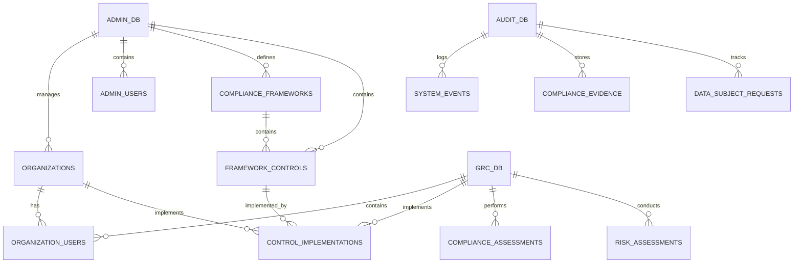
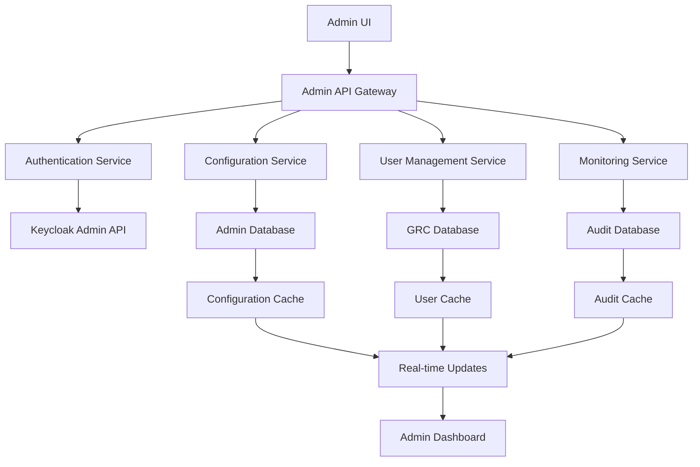

# HLOLA GRC Platform - Administration UI Design Document

## Table of Contents
1. [Executive Summary](#executive-summary)
2. [Administration UI Architecture](#administration-ui-architecture)
3. [Database Design Strategy](#database-design-strategy)
4. [Core Administration Modules](#core-administration-modules)
5. [Data Flow Architecture](#data-flow-architecture)
6. [User Management & Permissions](#user-management--permissions)
7. [System Configuration](#system-configuration)
8. [Monitoring & Analytics](#monitoring--analytics)
9. [Security & Compliance](#security--compliance)
10. [API Design](#api-design)
11. [Implementation Roadmap](#implementation-roadmap)

---

## Executive Summary

### Overview
The HLOLA GRC Platform Administration UI is a comprehensive management interface designed to configure, monitor, and maintain the entire GRC ecosystem. This system serves as the central control panel for platform administrators, compliance officers, and system operators to manage users, configure compliance frameworks, monitor system health, and ensure regulatory adherence.

### Key Objectives
- **Centralized Management**: Single interface for all GRC platform administration
- **Multi-Tenant Support**: Manage multiple organizations and their compliance requirements
- **Real-Time Monitoring**: Live system health and compliance status monitoring
- **Automated Configuration**: Streamlined setup and maintenance of compliance frameworks
- **Audit Trail**: Complete administrative action logging and compliance reporting

---

## Administration UI Architecture

### High-Level Architecture

```
┌─────────────────────────────────────────────────────────────┐
│                Administration UI Layer                      │
├─────────────────────────────────────────────────────────────┤
│  Dashboard  │  User Mgmt  │  Config  │  Monitoring  │  Audit │
├─────────────────────────────────────────────────────────────┤
│                    API Gateway Layer                        │
├─────────────────────────────────────────────────────────────┤
│  Auth Service  │  Admin API  │  Audit Service  │  Notifications │
├─────────────────────────────────────────────────────────────┤
│                    Microservices Layer                      │
├─────────────────────────────────────────────────────────────┤
│  User Service  │  Config Service  │  Monitor Service  │  Audit Service │
├─────────────────────────────────────────────────────────────┤
│                    Data Layer                               │
├─────────────────────────────────────────────────────────────┤
│  Admin DB  │  GRC DB  │  Audit DB  │  Cache  │  Logs  │
└─────────────────────────────────────────────────────────────┘
```

### Technology Stack

#### Frontend
- **Framework**: Next.js 15+ with TypeScript
- **UI Library**: Tailwind CSS with custom admin components
- **State Management**: Zustand for global state
- **Charts**: Chart.js / Recharts for analytics
- **Tables**: TanStack Table for data management
- **Forms**: React Hook Form with Zod validation

#### Backend
- **Runtime**: Node.js with TypeScript
- **Framework**: Express.js
- **Authentication**: Keycloak Admin API
- **Database**: PostgreSQL with Prisma ORM
- **Caching**: Redis
- **Queue**: Bull Queue for background jobs

---

## Database Design Strategy

### Database Architecture: Multi-Database Approach

#### **1. Administration Database (admin_db)**
**Purpose**: Store administrative configurations, user management, and system settings

```sql
-- Administration Database Schema
CREATE DATABASE hlola_admin_db;

-- Organizations Management
CREATE TABLE organizations (
  id UUID PRIMARY KEY DEFAULT gen_random_uuid(),
  name VARCHAR(255) NOT NULL,
  domain VARCHAR(255) UNIQUE,
  subscription_tier VARCHAR(50) NOT NULL,
  status VARCHAR(20) DEFAULT 'active',
  settings JSONB,
  created_at TIMESTAMP DEFAULT NOW(),
  updated_at TIMESTAMP DEFAULT NOW(),
  created_by UUID REFERENCES admin_users(id)
);

-- Admin Users (Platform Administrators)
CREATE TABLE admin_users (
  id UUID PRIMARY KEY DEFAULT gen_random_uuid(),
  email VARCHAR(255) UNIQUE NOT NULL,
  name VARCHAR(255) NOT NULL,
  role VARCHAR(50) NOT NULL, -- super_admin, admin, support
  permissions JSONB,
  is_active BOOLEAN DEFAULT true,
  last_login TIMESTAMP,
  created_at TIMESTAMP DEFAULT NOW(),
  updated_at TIMESTAMP DEFAULT NOW()
);

-- System Configuration
CREATE TABLE system_config (
  id UUID PRIMARY KEY DEFAULT gen_random_uuid(),
  key VARCHAR(255) UNIQUE NOT NULL,
  value JSONB NOT NULL,
  category VARCHAR(100),
  description TEXT,
  is_encrypted BOOLEAN DEFAULT false,
  created_at TIMESTAMP DEFAULT NOW(),
  updated_at TIMESTAMP DEFAULT NOW(),
  updated_by UUID REFERENCES admin_users(id)
);

-- Compliance Frameworks (Master Data)
CREATE TABLE compliance_frameworks (
  id UUID PRIMARY KEY DEFAULT gen_random_uuid(),
  name VARCHAR(255) NOT NULL,
  version VARCHAR(50) NOT NULL,
  region VARCHAR(100),
  category VARCHAR(50),
  description TEXT,
  is_active BOOLEAN DEFAULT true,
  metadata JSONB,
  created_at TIMESTAMP DEFAULT NOW(),
  updated_at TIMESTAMP DEFAULT NOW()
);

-- Framework Controls (Master Data)
CREATE TABLE framework_controls (
  id UUID PRIMARY KEY DEFAULT gen_random_uuid(),
  framework_id UUID REFERENCES compliance_frameworks(id),
  code VARCHAR(50) NOT NULL,
  title VARCHAR(500) NOT NULL,
  description TEXT,
  category VARCHAR(100),
  priority VARCHAR(20),
  requirements JSONB,
  created_at TIMESTAMP DEFAULT NOW(),
  updated_at TIMESTAMP DEFAULT NOW()
);

-- Audit Logs
CREATE TABLE admin_audit_logs (
  id UUID PRIMARY KEY DEFAULT gen_random_uuid(),
  admin_user_id UUID REFERENCES admin_users(id),
  action VARCHAR(100) NOT NULL,
  resource_type VARCHAR(100),
  resource_id UUID,
  details JSONB,
  ip_address INET,
  user_agent TEXT,
  created_at TIMESTAMP DEFAULT NOW()
);
```

#### **2. GRC Database (grc_db)**
**Purpose**: Store organization-specific GRC data and compliance information

```sql
-- GRC Database Schema
CREATE DATABASE hlola_grc_db;

-- Organization Users (End Users)
CREATE TABLE organization_users (
  id UUID PRIMARY KEY DEFAULT gen_random_uuid(),
  organization_id UUID NOT NULL,
  email VARCHAR(255) NOT NULL,
  name VARCHAR(255) NOT NULL,
  role VARCHAR(50) NOT NULL,
  department VARCHAR(100),
  permissions JSONB,
  is_active BOOLEAN DEFAULT true,
  created_at TIMESTAMP DEFAULT NOW(),
  updated_at TIMESTAMP DEFAULT NOW(),
  UNIQUE(organization_id, email)
);

-- Control Implementations (Organization-specific)
CREATE TABLE control_implementations (
  id UUID PRIMARY KEY DEFAULT gen_random_uuid(),
  organization_id UUID NOT NULL,
  control_id UUID NOT NULL,
  status VARCHAR(50) DEFAULT 'not_implemented',
  evidence JSONB,
  last_tested TIMESTAMP,
  next_review TIMESTAMP,
  assigned_to UUID REFERENCES organization_users(id),
  created_at TIMESTAMP DEFAULT NOW(),
  updated_at TIMESTAMP DEFAULT NOW()
);

-- Compliance Assessments
CREATE TABLE compliance_assessments (
  id UUID PRIMARY KEY DEFAULT gen_random_uuid(),
  organization_id UUID NOT NULL,
  framework_id UUID NOT NULL,
  assessment_date TIMESTAMP NOT NULL,
  score INTEGER,
  status VARCHAR(50),
  findings JSONB,
  recommendations JSONB,
  assessor_id UUID REFERENCES organization_users(id),
  created_at TIMESTAMP DEFAULT NOW(),
  updated_at TIMESTAMP DEFAULT NOW()
);

-- Risk Assessments
CREATE TABLE risk_assessments (
  id UUID PRIMARY KEY DEFAULT gen_random_uuid(),
  organization_id UUID NOT NULL,
  title VARCHAR(255) NOT NULL,
  description TEXT,
  category VARCHAR(100),
  severity VARCHAR(20),
  likelihood VARCHAR(20),
  impact VARCHAR(20),
  risk_score INTEGER,
  status VARCHAR(50),
  owner_id UUID REFERENCES organization_users(id),
  created_at TIMESTAMP DEFAULT NOW(),
  updated_at TIMESTAMP DEFAULT NOW()
);
```

#### **3. Audit Database (audit_db)**
**Purpose**: Store immutable audit logs and compliance evidence

```sql
-- Audit Database Schema
CREATE DATABASE hlola_audit_db;

-- System Events
CREATE TABLE system_events (
  id UUID PRIMARY KEY DEFAULT gen_random_uuid(),
  event_type VARCHAR(100) NOT NULL,
  event_data JSONB NOT NULL,
  user_id UUID,
  organization_id UUID,
  ip_address INET,
  user_agent TEXT,
  timestamp TIMESTAMP DEFAULT NOW()
);

-- Compliance Evidence
CREATE TABLE compliance_evidence (
  id UUID PRIMARY KEY DEFAULT gen_random_uuid(),
  organization_id UUID NOT NULL,
  control_id UUID NOT NULL,
  evidence_type VARCHAR(50) NOT NULL,
  file_path VARCHAR(500),
  file_hash VARCHAR(64),
  metadata JSONB,
  uploaded_by UUID,
  created_at TIMESTAMP DEFAULT NOW()
);

-- Data Subject Requests
CREATE TABLE data_subject_requests (
  id UUID PRIMARY KEY DEFAULT gen_random_uuid(),
  organization_id UUID NOT NULL,
  request_type VARCHAR(50) NOT NULL,
  requester_email VARCHAR(255) NOT NULL,
  status VARCHAR(50) DEFAULT 'pending',
  request_data JSONB,
  response_data JSONB,
  created_at TIMESTAMP DEFAULT NOW(),
  updated_at TIMESTAMP DEFAULT NOW()
);
```

### Database Relationships



---

## Core Administration Modules

### 1. Dashboard & Overview

#### **System Overview Dashboard**
```typescript
interface SystemOverview {
  totalOrganizations: number;
  activeUsers: number;
  complianceScore: number;
  systemHealth: SystemHealth;
  recentActivities: Activity[];
  alerts: Alert[];
  keyMetrics: KeyMetrics;
}

interface SystemHealth {
  status: 'healthy' | 'warning' | 'critical';
  uptime: number;
  responseTime: number;
  errorRate: number;
  databaseStatus: 'connected' | 'disconnected';
  cacheStatus: 'connected' | 'disconnected';
}
```

#### **Real-Time Monitoring**
- **System Metrics**: CPU, Memory, Disk, Network usage
- **Database Performance**: Query times, connection pools, slow queries
- **API Performance**: Response times, error rates, throughput
- **User Activity**: Active sessions, login patterns, feature usage
- **Compliance Status**: Real-time compliance scores across organizations

### 2. Organization Management

#### **Organization Administration**
```typescript
interface OrganizationAdmin {
  // Organization Details
  organization: {
    id: string;
    name: string;
    domain: string;
    subscriptionTier: 'basic' | 'professional' | 'enterprise';
    status: 'active' | 'suspended' | 'trial';
    settings: OrganizationSettings;
    createdAt: string;
    lastActivity: string;
  };
  
  // User Management
  users: {
    total: number;
    active: number;
    pending: number;
    suspended: number;
  };
  
  // Compliance Status
  compliance: {
    frameworks: FrameworkStatus[];
    overallScore: number;
    lastAssessment: string;
    nextReview: string;
  };
  
  // Usage Statistics
  usage: {
    apiCalls: number;
    storageUsed: string;
    featuresUsed: string[];
    lastLogin: string;
  };
}
```

#### **Organization Configuration**
- **Subscription Management**: Tier upgrades, billing, feature access
- **User Limits**: Maximum users, role assignments, permission management
- **Compliance Frameworks**: Enabled frameworks, custom configurations
- **Integration Settings**: API keys, webhooks, third-party connections
- **Data Retention**: Backup policies, data retention periods

### 3. User Management & Permissions

#### **Multi-Level User Management**
```typescript
interface UserManagement {
  // Admin Users (Platform Administrators)
  adminUsers: {
    superAdmins: AdminUser[];
    admins: AdminUser[];
    supportStaff: AdminUser[];
  };
  
  // Organization Users (End Users)
  organizationUsers: {
    [organizationId: string]: {
      users: OrganizationUser[];
      roles: Role[];
      permissions: Permission[];
    };
  };
  
  // Role-Based Access Control
  rbac: {
    roles: Role[];
    permissions: Permission[];
    policies: Policy[];
  };
}

interface Role {
  id: string;
  name: string;
  description: string;
  permissions: string[];
  isSystemRole: boolean;
  organizationId?: string;
  createdAt: string;
  updatedAt: string;
}

interface Permission {
  id: string;
  name: string;
  resource: string;
  action: string;
  conditions?: string[];
  description: string;
}
```

#### **Permission Management System**
- **Granular Permissions**: Resource-based permissions with specific actions
- **Role Templates**: Pre-defined roles for common use cases
- **Custom Roles**: Organization-specific role creation
- **Permission Inheritance**: Hierarchical permission structure
- **Temporary Access**: Time-limited permissions for specific tasks

### 4. Compliance Framework Management

#### **Framework Administration**
```typescript
interface FrameworkManagement {
  // Master Framework Library
  frameworks: {
    available: ComplianceFramework[];
    active: ComplianceFramework[];
    deprecated: ComplianceFramework[];
  };
  
  // Control Management
  controls: {
    total: number;
    byCategory: Record<string, number>;
    byPriority: Record<string, number>;
    byFramework: Record<string, number>;
  };
  
  // Framework Updates
  updates: {
    pending: FrameworkUpdate[];
    applied: FrameworkUpdate[];
    scheduled: FrameworkUpdate[];
  };
}

interface ComplianceFramework {
  id: string;
  name: string;
  version: string;
  region: string;
  category: 'Privacy' | 'Security' | 'Compliance' | 'Risk';
  description: string;
  isActive: boolean;
  controls: FrameworkControl[];
  metadata: {
    lastUpdated: string;
    nextReview: string;
    source: string;
    complianceLevel: string;
  };
  createdAt: string;
  updatedAt: string;
}
```

#### **Framework Configuration Features**
- **Framework Library**: Central repository of compliance frameworks
- **Version Control**: Track framework updates and changes
- **Custom Frameworks**: Create organization-specific frameworks
- **Control Mapping**: Map controls across different frameworks
- **Automated Updates**: Push framework updates to organizations
- **Compliance Scoring**: Configure scoring algorithms and thresholds

### 5. System Configuration

#### **Platform Configuration**
```typescript
interface SystemConfiguration {
  // General Settings
  general: {
    platformName: string;
    timezone: string;
    language: string;
    maintenanceMode: boolean;
    debugMode: boolean;
  };
  
  // Security Settings
  security: {
    passwordPolicy: PasswordPolicy;
    mfaSettings: MFASettings;
    sessionSettings: SessionSettings;
    encryptionSettings: EncryptionSettings;
  };
  
  // Integration Settings
  integrations: {
    keycloak: KeycloakConfig;
    email: EmailConfig;
    sms: SMSConfig;
    webhooks: WebhookConfig[];
  };
  
  // Performance Settings
  performance: {
    cacheSettings: CacheSettings;
    databaseSettings: DatabaseSettings;
    apiSettings: APISettings;
  };
}
```

#### **Configuration Management**
- **Environment Settings**: Development, staging, production configurations
- **Feature Flags**: Enable/disable features across the platform
- **API Configuration**: Rate limits, timeouts, retry policies
- **Notification Settings**: Email, SMS, in-app notification preferences
- **Backup Configuration**: Automated backup schedules and retention

### 6. Monitoring & Analytics

#### **System Monitoring**
```typescript
interface SystemMonitoring {
  // Performance Metrics
  performance: {
    responseTime: MetricData[];
    throughput: MetricData[];
    errorRate: MetricData[];
    availability: MetricData[];
  };
  
  // Resource Usage
  resources: {
    cpu: ResourceUsage;
    memory: ResourceUsage;
    disk: ResourceUsage;
    network: ResourceUsage;
  };
  
  // Database Metrics
  database: {
    connectionPool: DatabaseMetrics;
    queryPerformance: QueryMetrics[];
    slowQueries: SlowQuery[];
    replicationLag: number;
  };
  
  // Application Metrics
  application: {
    activeUsers: number;
    apiCalls: APIMetrics;
    featureUsage: FeatureUsage[];
    errorLogs: ErrorLog[];
  };
}

interface MetricData {
  timestamp: string;
  value: number;
  label?: string;
}

interface ResourceUsage {
  current: number;
  average: number;
  peak: number;
  threshold: number;
  status: 'normal' | 'warning' | 'critical';
}
```

#### **Analytics Dashboard**
- **Usage Analytics**: User behavior, feature adoption, engagement metrics
- **Performance Analytics**: System performance trends, bottleneck identification
- **Compliance Analytics**: Compliance score trends, framework adoption rates
- **Business Intelligence**: Custom reports, data visualization, export capabilities

### 7. Audit & Compliance

#### **Audit Management**
```typescript
interface AuditManagement {
  // Audit Logs
  auditLogs: {
    systemEvents: AuditEvent[];
    userActions: UserAction[];
    dataChanges: DataChange[];
    securityEvents: SecurityEvent[];
  };
  
  // Compliance Reports
  complianceReports: {
    frameworkCompliance: ComplianceReport[];
    riskAssessments: RiskReport[];
    dataSubjectRequests: DSRReport[];
    incidentReports: IncidentReport[];
  };
  
  // Evidence Management
  evidence: {
    totalFiles: number;
    totalSize: string;
    byType: Record<string, number>;
    retentionStatus: RetentionStatus[];
  };
}

interface AuditEvent {
  id: string;
  timestamp: string;
  eventType: string;
  userId: string;
  organizationId: string;
  resourceType: string;
  resourceId: string;
  action: string;
  details: Record<string, any>;
  ipAddress: string;
  userAgent: string;
}
```

#### **Compliance Features**
- **Audit Trail**: Complete logging of all administrative actions
- **Compliance Reporting**: Automated compliance report generation
- **Evidence Collection**: Centralized evidence storage and management
- **Data Subject Rights**: DSR request tracking and management
- **Incident Management**: Security incident tracking and response

---

## Data Flow Architecture

### 1. Data Ingestion Flow



### 2. Real-Time Data Synchronization

#### **Event-Driven Architecture**
```typescript
interface EventSystem {
  // Event Types
  events: {
    userCreated: UserCreatedEvent;
    userUpdated: UserUpdatedEvent;
    userDeleted: UserDeletedEvent;
    organizationCreated: OrganizationCreatedEvent;
    configurationChanged: ConfigurationChangedEvent;
    complianceUpdated: ComplianceUpdatedEvent;
  };
  
  // Event Handlers
  handlers: {
    auditLogger: EventHandler;
    notificationService: EventHandler;
    cacheUpdater: EventHandler;
    webhookDispatcher: EventHandler;
  };
  
  // Event Store
  eventStore: {
    events: Event[];
    projections: Projection[];
    snapshots: Snapshot[];
  };
}

interface Event {
  id: string;
  type: string;
  aggregateId: string;
  aggregateType: string;
  version: number;
  data: Record<string, any>;
  metadata: EventMetadata;
  timestamp: string;
}
```

### 3. Data Validation & Transformation

#### **Data Pipeline**
```typescript
interface DataPipeline {
  // Input Validation
  validation: {
    schema: JSONSchema;
    rules: ValidationRule[];
    sanitization: SanitizationRule[];
  };
  
  // Data Transformation
  transformation: {
    mappers: DataMapper[];
    filters: DataFilter[];
    aggregators: DataAggregator[];
  };
  
  // Data Quality
  quality: {
    checks: QualityCheck[];
    metrics: QualityMetric[];
    alerts: QualityAlert[];
  };
}

interface ValidationRule {
  field: string;
  type: 'required' | 'format' | 'range' | 'custom';
  value?: any;
  message: string;
}
```

---

## User Management & Permissions

### 1. Multi-Tenant User Architecture

#### **User Hierarchy**
```
Platform Level
├── Super Administrators
│   ├── Full platform access
│   ├── Organization management
│   └── System configuration
├── Platform Administrators
│   ├── Organization management
│   ├── User management
│   └── Limited system access
└── Support Staff
    ├── User support
    ├── Basic monitoring
    └── Limited administrative access

Organization Level
├── Organization Administrators
│   ├── Full organization access
│   ├── User management
│   └── Compliance management
├── Compliance Officers
│   ├── Compliance management
│   ├── Risk assessment
│   └── Audit coordination
├── Department Managers
│   ├── Department users
│   ├── Limited compliance access
│   └── Reporting
└── End Users
    ├── Basic GRC features
    ├── Self-service
    └── Limited permissions
```

### 2. Permission System

#### **Resource-Based Permissions**
```typescript
interface PermissionSystem {
  // Resources
  resources: {
    organizations: ResourcePermission;
    users: ResourcePermission;
    frameworks: ResourcePermission;
    controls: ResourcePermission;
    assessments: ResourcePermission;
    reports: ResourcePermission;
    system: ResourcePermission;
  };
  
  // Actions
  actions: {
    create: ActionPermission;
    read: ActionPermission;
    update: ActionPermission;
    delete: ActionPermission;
    execute: ActionPermission;
    approve: ActionPermission;
    export: ActionPermission;
  };
  
  // Conditions
  conditions: {
    organizationScope: ConditionRule;
    timeBased: ConditionRule;
    ipRestriction: ConditionRule;
    mfaRequired: ConditionRule;
  };
}

interface ResourcePermission {
  resource: string;
  actions: string[];
  conditions?: string[];
  fields?: string[];
  records?: string[];
}
```

### 3. Role Management

#### **Predefined Roles**
```typescript
const PREDEFINED_ROLES = {
  // Platform Level
  SUPER_ADMIN: {
    name: 'Super Administrator',
    permissions: ['*:*:*'], // All permissions
    scope: 'platform',
    description: 'Full platform access and control'
  },
  
  PLATFORM_ADMIN: {
    name: 'Platform Administrator',
    permissions: [
      'organizations:*:*',
      'users:*:*',
      'frameworks:read:*',
      'system:read:*'
    ],
    scope: 'platform',
    description: 'Platform administration and user management'
  },
  
  // Organization Level
  ORG_ADMIN: {
    name: 'Organization Administrator',
    permissions: [
      'users:create:own_org',
      'users:read:own_org',
      'users:update:own_org',
      'compliance:*:own_org',
      'reports:*:own_org'
    ],
    scope: 'organization',
    description: 'Full organization management'
  },
  
  COMPLIANCE_OFFICER: {
    name: 'Compliance Officer',
    permissions: [
      'frameworks:read:*',
      'controls:*:own_org',
      'assessments:*:own_org',
      'reports:read:own_org'
    ],
    scope: 'organization',
    description: 'Compliance management and monitoring'
  }
};
```

---

## System Configuration

### 1. Configuration Management

#### **Configuration Categories**
```typescript
interface ConfigurationCategories {
  // System Configuration
  system: {
    platform: PlatformConfig;
    security: SecurityConfig;
    performance: PerformanceConfig;
    maintenance: MaintenanceConfig;
  };
  
  // Integration Configuration
  integrations: {
    authentication: AuthConfig;
    email: EmailConfig;
    sms: SMSConfig;
    webhooks: WebhookConfig[];
    apis: APIConfig[];
  };
  
  // Compliance Configuration
  compliance: {
    frameworks: FrameworkConfig;
    controls: ControlConfig;
    assessments: AssessmentConfig;
    reporting: ReportingConfig;
  };
  
  // Monitoring Configuration
  monitoring: {
    metrics: MetricsConfig;
    alerts: AlertsConfig;
    logging: LoggingConfig;
    dashboards: DashboardConfig;
  };
}
```

### 2. Feature Flags

#### **Feature Management**
```typescript
interface FeatureFlags {
  // Platform Features
  platform: {
    maintenanceMode: boolean;
    debugMode: boolean;
    betaFeatures: boolean;
    newUI: boolean;
  };
  
  // Compliance Features
  compliance: {
    advancedReporting: boolean;
    aiInsights: boolean;
    automatedAssessments: boolean;
    realTimeMonitoring: boolean;
  };
  
  // Integration Features
  integrations: {
    keycloakSSO: boolean;
    ldapIntegration: boolean;
    webhookNotifications: boolean;
    apiAccess: boolean;
  };
  
  // Organization Features
  organization: {
    customFrameworks: boolean;
    advancedPermissions: boolean;
    dataExport: boolean;
    whiteLabeling: boolean;
  };
}
```

### 3. Environment Management

#### **Multi-Environment Support**
```typescript
interface EnvironmentConfig {
  development: EnvironmentSettings;
  staging: EnvironmentSettings;
  production: EnvironmentSettings;
}

interface EnvironmentSettings {
  database: DatabaseConfig;
  cache: CacheConfig;
  queue: QueueConfig;
  storage: StorageConfig;
  monitoring: MonitoringConfig;
  security: SecurityConfig;
  features: FeatureFlags;
}
```

---

## Monitoring & Analytics

### 1. System Health Monitoring

#### **Health Check System**
```typescript
interface HealthCheckSystem {
  // System Components
  components: {
    database: HealthStatus;
    cache: HealthStatus;
    queue: HealthStatus;
    storage: HealthStatus;
    apis: HealthStatus;
    integrations: HealthStatus;
  };
  
  // Performance Metrics
  performance: {
    responseTime: PerformanceMetric;
    throughput: PerformanceMetric;
    errorRate: PerformanceMetric;
    availability: PerformanceMetric;
  };
  
  // Resource Usage
  resources: {
    cpu: ResourceMetric;
    memory: ResourceMetric;
    disk: ResourceMetric;
    network: ResourceMetric;
  };
  
  // Alerts
  alerts: {
    active: Alert[];
    resolved: Alert[];
    suppressed: Alert[];
  };
}

interface HealthStatus {
  status: 'healthy' | 'degraded' | 'unhealthy';
  lastCheck: string;
  responseTime: number;
  error?: string;
  details: Record<string, any>;
}
```

### 2. Business Intelligence

#### **Analytics Dashboard**
```typescript
interface AnalyticsDashboard {
  // User Analytics
  users: {
    totalUsers: number;
    activeUsers: number;
    newUsers: number;
    userGrowth: TrendData;
    userEngagement: EngagementMetrics;
  };
  
  // Compliance Analytics
  compliance: {
    overallScore: number;
    frameworkAdoption: FrameworkAdoption[];
    complianceTrends: ComplianceTrend[];
    riskDistribution: RiskDistribution;
  };
  
  // Platform Analytics
  platform: {
    apiUsage: APIUsageMetrics;
    featureUsage: FeatureUsageMetrics;
    performanceMetrics: PerformanceMetrics;
    errorRates: ErrorRateMetrics;
  };
  
  // Business Metrics
  business: {
    revenue: RevenueMetrics;
    customerSatisfaction: SatisfactionMetrics;
    supportTickets: SupportMetrics;
    churnRate: ChurnMetrics;
  };
}
```

### 3. Reporting System

#### **Report Generation**
```typescript
interface ReportingSystem {
  // Report Types
  reports: {
    compliance: ComplianceReport[];
    performance: PerformanceReport[];
    security: SecurityReport[];
    business: BusinessReport[];
    custom: CustomReport[];
  };
  
  // Report Scheduling
  scheduling: {
    scheduled: ScheduledReport[];
    oneTime: OneTimeReport[];
    realTime: RealTimeReport[];
  };
  
  // Report Distribution
  distribution: {
    email: EmailDistribution[];
    webhook: WebhookDistribution[];
    api: APIDistribution[];
    download: DownloadDistribution[];
  };
}

interface ComplianceReport {
  id: string;
  name: string;
  type: 'framework' | 'control' | 'assessment' | 'risk';
  organizationId: string;
  frameworkId?: string;
  period: DateRange;
  data: ComplianceData;
  generatedAt: string;
  generatedBy: string;
}
```

---

## Security & Compliance

### 1. Security Architecture

#### **Security Layers**
```typescript
interface SecurityArchitecture {
  // Authentication
  authentication: {
    provider: 'keycloak';
    mfa: MFAConfig;
    sso: SSOConfig;
    session: SessionConfig;
  };
  
  // Authorization
  authorization: {
    rbac: RBACConfig;
    abac: ABACConfig;
    permissions: PermissionConfig;
    policies: PolicyConfig;
  };
  
  // Data Protection
  dataProtection: {
    encryption: EncryptionConfig;
    masking: MaskingConfig;
    anonymization: AnonymizationConfig;
    retention: RetentionConfig;
  };
  
  // Network Security
  networkSecurity: {
    firewall: FirewallConfig;
    vpn: VPNConfig;
    cdn: CDNConfig;
    ddos: DDoSConfig;
  };
}
```

### 2. Compliance Management

#### **Compliance Framework**
```typescript
interface ComplianceFramework {
  // Regulatory Compliance
  regulatory: {
    gdpr: GDPRCompliance;
    popia: POPIACompliance;
    ccpa: CCPACompliance;
    sox: SOXCompliance;
  };
  
  // Security Standards
  security: {
    iso27001: ISO27001Compliance;
    soc2: SOC2Compliance;
    pci: PCICompliance;
    hipaa: HIPAACompliance;
  };
  
  // Industry Standards
  industry: {
    nist: NISTCompliance;
    cobit: COBITCompliance;
    itil: ITILCompliance;
    custom: CustomCompliance;
  };
}
```

### 3. Audit & Logging

#### **Comprehensive Audit System**
```typescript
interface AuditSystem {
  // Audit Categories
  categories: {
    authentication: AuditCategory;
    authorization: AuditCategory;
    dataAccess: AuditCategory;
    configuration: AuditCategory;
    compliance: AuditCategory;
    security: AuditCategory;
  };
  
  // Log Levels
  levels: {
    debug: LogLevel;
    info: LogLevel;
    warn: LogLevel;
    error: LogLevel;
    critical: LogLevel;
  };
  
  // Retention Policies
  retention: {
    auditLogs: RetentionPolicy;
    systemLogs: RetentionPolicy;
    accessLogs: RetentionPolicy;
    errorLogs: RetentionPolicy;
  };
}
```

---

## API Design

### 1. Administration API

#### **RESTful API Endpoints**
```typescript
// Organization Management
GET    /api/admin/organizations
POST   /api/admin/organizations
GET    /api/admin/organizations/:id
PUT    /api/admin/organizations/:id
DELETE /api/admin/organizations/:id

// User Management
GET    /api/admin/users
POST   /api/admin/users
GET    /api/admin/users/:id
PUT    /api/admin/users/:id
DELETE /api/admin/users/:id

// System Configuration
GET    /api/admin/config
PUT    /api/admin/config
GET    /api/admin/config/:key
PUT    /api/admin/config/:key

// Monitoring
GET    /api/admin/health
GET    /api/admin/metrics
GET    /api/admin/alerts
POST   /api/admin/alerts/:id/resolve

// Audit
GET    /api/admin/audit/logs
GET    /api/admin/audit/events
GET    /api/admin/audit/reports
```

### 2. GraphQL Schema

#### **Admin GraphQL Schema**
```graphql
type Query {
  # System Overview
  systemOverview: SystemOverview!
  healthStatus: HealthStatus!
  
  # Organizations
  organizations(
    filter: OrganizationFilter
    pagination: PaginationInput
  ): OrganizationConnection!
  organization(id: ID!): Organization
  
  # Users
  users(
    filter: UserFilter
    pagination: PaginationInput
  ): UserConnection!
  user(id: ID!): User
  
  # Configuration
  configuration: Configuration!
  featureFlags: FeatureFlags!
  
  # Monitoring
  metrics(
    type: MetricType!
    timeRange: TimeRangeInput
  ): [Metric!]!
  alerts(
    status: AlertStatus
    severity: AlertSeverity
  ): [Alert!]!
  
  # Audit
  auditLogs(
    filter: AuditFilter
    pagination: PaginationInput
  ): AuditLogConnection!
}

type Mutation {
  # Organization Management
  createOrganization(input: CreateOrganizationInput!): Organization!
  updateOrganization(id: ID!, input: UpdateOrganizationInput!): Organization!
  deleteOrganization(id: ID!): Boolean!
  
  # User Management
  createUser(input: CreateUserInput!): User!
  updateUser(id: ID!, input: UpdateUserInput!): User!
  deleteUser(id: ID!): Boolean!
  
  # Configuration
  updateConfiguration(input: UpdateConfigurationInput!): Configuration!
  updateFeatureFlags(input: UpdateFeatureFlagsInput!): FeatureFlags!
  
  # System Actions
  triggerBackup: Boolean!
  clearCache: Boolean!
  restartService(service: String!): Boolean!
}

type Subscription {
  # Real-time Updates
  systemHealth: HealthStatus!
  newAlert: Alert!
  userActivity: UserActivity!
  complianceUpdate: ComplianceUpdate!
}
```

### 3. WebSocket Events

#### **Real-Time Communication**
```typescript
interface WebSocketEvents {
  // System Events
  'system.health.update': HealthUpdateEvent;
  'system.alert.new': NewAlertEvent;
  'system.alert.resolved': AlertResolvedEvent;
  
  // User Events
  'user.created': UserCreatedEvent;
  'user.updated': UserUpdatedEvent;
  'user.deleted': UserDeletedEvent;
  'user.login': UserLoginEvent;
  'user.logout': UserLogoutEvent;
  
  // Organization Events
  'organization.created': OrganizationCreatedEvent;
  'organization.updated': OrganizationUpdatedEvent;
  'organization.suspended': OrganizationSuspendedEvent;
  
  // Compliance Events
  'compliance.assessment.completed': AssessmentCompletedEvent;
  'compliance.framework.updated': FrameworkUpdatedEvent;
  'compliance.control.implemented': ControlImplementedEvent;
}
```

---

## Implementation Roadmap

### Phase 1: Foundation (Months 1-2)
- [ ] **Database Setup**
  - [ ] Create multi-database architecture
  - [ ] Set up database connections and migrations
  - [ ] Implement data validation and constraints
  
- [ ] **Authentication & Authorization**
  - [ ] Integrate Keycloak Admin API
  - [ ] Implement RBAC system
  - [ ] Set up permission management
  
- [ ] **Basic Admin UI**
  - [ ] Create admin dashboard layout
  - [ ] Implement user management interface
  - [ ] Build organization management UI

### Phase 2: Core Features (Months 3-4)
- [ ] **System Configuration**
  - [ ] Build configuration management UI
  - [ ] Implement feature flags system
  - [ ] Create environment management
  
- [ ] **Monitoring & Analytics**
  - [ ] Set up system health monitoring
  - [ ] Implement real-time metrics
  - [ ] Create analytics dashboard
  
- [ ] **Compliance Management**
  - [ ] Build framework management UI
  - [ ] Implement control management
  - [ ] Create compliance reporting

### Phase 3: Advanced Features (Months 5-6)
- [ ] **Audit & Logging**
  - [ ] Implement comprehensive audit system
  - [ ] Create audit log viewer
  - [ ] Build compliance reporting
  
- [ ] **Advanced Monitoring**
  - [ ] Set up business intelligence
  - [ ] Implement custom reporting
  - [ ] Create alert management
  
- [ ] **Integration Management**
  - [ ] Build integration configuration UI
  - [ ] Implement webhook management
  - [ ] Create API management

### Phase 4: Optimization (Months 7-8)
- [ ] **Performance Optimization**
  - [ ] Optimize database queries
  - [ ] Implement caching strategies
  - [ ] Improve UI performance
  
- [ ] **Security Hardening**
  - [ ] Implement advanced security features
  - [ ] Set up security monitoring
  - [ ] Create security reporting
  
- [ ] **Documentation & Training**
  - [ ] Create admin documentation
  - [ ] Build training materials
  - [ ] Implement help system

---

## Conclusion

The HLOLA GRC Platform Administration UI provides a comprehensive management interface for the entire GRC ecosystem. The multi-database architecture ensures data separation and security, while the modular design allows for scalable and maintainable administration capabilities.

Key benefits of this design:
- **Centralized Management**: Single interface for all administrative tasks
- **Multi-Tenant Support**: Efficient management of multiple organizations
- **Real-Time Monitoring**: Live system health and compliance monitoring
- **Scalable Architecture**: Designed to grow with the platform
- **Security-First**: Built with security and compliance in mind
- **User-Friendly**: Intuitive interface for administrators of all levels

This administration system will serve as the backbone for managing the HLOLA GRC Platform, ensuring smooth operations, compliance adherence, and optimal user experience across all organizations using the platform.
